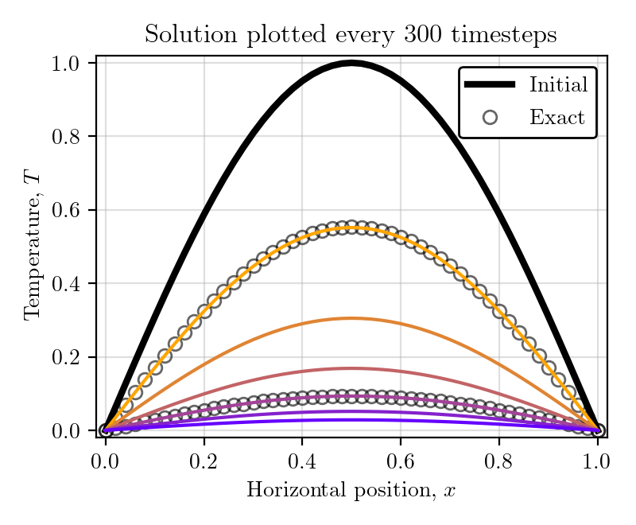

# Solving the diffusion equation using Finite Differences

## Project Summary

## Introduction
Diffusion describes motion from high concentration to low concentration, a common example is heat which diffuses from hot to cold - think of how the amount of heat you feel from a radiator becomes less as you move further away from it. The time-dependent diffusion equation for a scalar field, $T$, is given by 
$$\dfrac{\partial T}{\partial t}= \kappa \dfrac{\partial ^2 T}{\partial x^2}.$$
Here $\kappa$ is the diffusivity with units $m^2/s$.

Diffusion acts to spread the field uniformly eventually leading to a uniform temperature in the absence of any sources or sinks.

## 1D Formulation
The diffusion equation can be discretised on to a grid of points in space and time (indexed by $j$ and $n$, respectively). Here, we implement the forward in time and centred in space (FTCS) scheme which approximates temporal and spatial derivatives, respectively, as
$$\dfrac{\partial T}{\partial t} = \dfrac{T^{n+1}_j-T^n_j}{\Delta t}, \dfrac{\partial^2 T}{\partial x^2} = \dfrac{T^n\_{j+1}-2T^n_j+T^n\_{j-1}}{2 \Delta x^2},$$

The discretised equation then reads
$$\dfrac{T^{n+1}_j-T^n_j}{\Delta t} = \nu \dfrac{T^n\_{j+1}-2T^n_j+T^n\_{j-1}}{2 \Delta x ^2}$$

$$T^{n+1}_j = \dfrac{\nu \Delta t}{\Delta x^2} \left(T^n\_{j+1}-2T^n_j+T^n\_{j-1} \right).$$

where $C = \nu \Delta t/ \Delta x^2$, known as the Courant number. The Courant number indicates how far information travels, if greater than one, it means that the information propagates through more than one grid cell at each time step, making the solution inaccurate and potentially leading to nonphysical results or divergence of the solution. Our chosen formulation is only stable when $C \leq 0.5$ and so we set $C=0.5$ for most of our calculations and compute our time-step to guarantee stability.
 
To close the system, two boundary conditions are needed. We use both Dirichlet, Neumann and a combination of the two. Dirichlet boundaries specify the value itself on the boundary whereas Neumann conditions specify the flux across the boundary, if the spatial grid is labelled from 0 to $Nx$ inclusive, then a Dirichlet left boundary 
$$T(0) = T_1$$
$$\dfrac{dT(Nx)}{dx}=0.$$
In practice, the discretised evolution equation and boundary conditions are solved over all space $(j)$ and then looped over the total number of timesteps.

  

## 2D Formulation

## Varying diffusivity

## Final Thoughts

## Numerically solving the diffusion equation

For this example we choose to use a scalar field with an exponential time dependence and a sinusoidal spatial dependence (for details expand below) 
$$T=\exp(-\nu \pi^2 t)\sin(\pi x)$$
for which the initial condition, obtained by substituting $t=0$ gives
$$T_0=\sin(\pi x).$$

Looking at the governing equation we can use seperation of variables to write field, $T$, as $T=T(t,x)=f(t)g(x)$. For the solution to satisfy the equation, $f(t)$ must differentiate to give something that is proportional to itself - an exponential function has this property, $f(t)=\exp(-at))$. Here, $a$ is a constant to be determined and there must be a negative sign as the solution decreases with time. The spatial component should differentiate twice to give something proportional to itself so we choose a sinusoidal function, $g(x) = sin(\pi * x)$. Now, $T=exp(-at)sin(\pi x)$. We can work out the value of a by subsituting T into the equation and carryying out the differenttation.
$$\dfrac{\partial exp(-at)sin(\pi x)}{\partial t} = \nu \dfrac{\partial ^2 exp(-at)sin(\pi x)}{\partial x^2}$$
$$-a exp(-at)sin(\pi x) = $\nu \pi^2 \exp(-at)sin(\pi x).$$
Comparing coefficients tells us that
$$a=\nu \pi^2$$
and the expression for the scalar field is
$$T=\exp(-\nu \pi^2 t)\sin(\pi x).$$

For a given initial condition, $u_0=u(x,0)$, this equation has an analytical solution,
$$u(x,t)=u_0(x-ut).$$
This analytical solution allows us to compute the error of different implementations and directly compare finite difference schemes against one another.

## Implicit Scheme
Unlike explicit schemes which use only values at the current and previous timesteps to predict the next-step, implicit schemes also use values at the time-step $(n+1)$ to calculate values at time-step, $n+1$. When correctly formulated, implicit schemes can be stable for arbitrarily large time-step, although they will not necessarily give high accuracy in time and they can be computationally expensive per time-step. 

The backward in time, centred in space scheme is:
$$u^{n+1}_j=u^n_j-\dfrac{c}{2}\left(u^{n+1}\_{j+1}-u^{n+1}\_{j-1}\right).$$
In order to evaluate all the values of $u_j^{n+1}$ we solve the set of simultaneous equations given in matrix form. This matrix is dependent on the boundary conditions, our case of periodic boundary conditions gives $u_0=u\_{N}$:
$$u^{n+1}_0=u^n_0-\dfrac{c}{2}\left(u^{n+1}\_{1}-u^{n+1}\_{N-1}\right),$$
$$u^{n+1}\_{N-1}=u^n\_{N-1}-\dfrac{c}{2}\left(u^{0}\_{1}-u^{n+1}\_{N-2}\right).$$
The matrix equation,

  

is solved using Gaussian elimination giving $\boldsymbol{u}^{n+1}=M^{-1}\boldsymbol{u}^n$. Other computational tools to solves sets of linear simultaneous equations include the Jacobi method, Gauss-Seidel method or the conjugate gradient.

## A comparison
